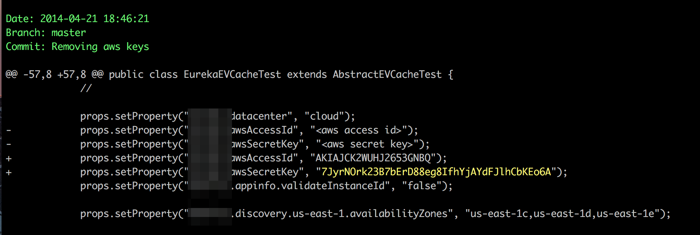

# 

[](https://www.godaddy.com/engineering/slack/)
[](https://github.com/godaddy/tartufo/actions?query=workflow%3Aci)
[](https://codecov.io/gh/godaddy/tartufo)
[](https://pypi.org/project/tartufo/)
[](https://pypi.org/project/tartufo/)
[](https://pypi.org/project/tartufo/)
[](https://pypi.org/project/tartufo/)
[](https://tartufo.readthedocs.io/en/latest/?badge=latest)
[](https://github.com/godaddy/tartufo/blob/main/LICENSE)

`tartufo` searches through git repositories for secrets, digging deep into
commit history and branches. This is effective at finding secrets accidentally
committed. `tartufo` also can be used by git pre-commit scripts to screen
changes for secrets before they are committed to the repository.

This tool will go through the entire commit history of each branch, and check
each diff from each commit, and check for secrets. This is both by regex and by
entropy. For entropy checks, tartufo will evaluate the shannon entropy for both
the base64 char set and hexidecimal char set for every blob of text greater
than 20 characters comprised of those character sets in each diff. If at any
point a high entropy string > 20 characters is detected, it will print to the
screen.

## Example



## Documentation

Our main documentation site is hosted by Read The Docs, at
<https://tartufo.readthedocs.io>.

## Usage

```bash
Usage: tartufo [OPTIONS] COMMAND [ARGS]...

  Find secrets hidden in the depths of git.

  Tartufo will, by default, scan the entire history of a git repository for
  any text which looks like a secret, password, credential, etc. It can also
  be made to work in pre-commit mode, for scanning blobs of text as a pre-
  commit hook.

Options:
  --rules FILENAME                [DEPRECATED] Use the rule-patterns config
                                  options instead. Path(s) to regex rules json
                                  list file(s).
  --default-regexes / --no-default-regexes
                                  Whether to include the default regex list
                                  when configuring search patterns. Only
                                  applicable if --rules is also specified.
                                  [default: default-regexes]
  --entropy / --no-entropy        Enable entropy checks.  [default: entropy]
  --regex / --no-regex            Enable high signal regexes checks.
                                  [default: regex]
  --scan-filenames / --no-scan-filenames
                                  Check the names of files being scanned as
                                  well as their contents.  [default: scan-
                                  filenames]
  -ip, --include-path-patterns TEXT
                                  Specify a regular expression which matches
                                  Git object paths to include in the scan.
                                  This option can be specified multiple times
                                  to include multiple patterns. If not
                                  provided (default), all Git object paths are
                                  included unless otherwise excluded via the
                                  --exclude-path-patterns option.
  -xp, --exclude-path-patterns TEXT
                                  Specify a regular expression which matches
                                  Git object paths to exclude from the scan.
                                  This option can be specified multiple times
                                  to exclude multiple patterns. If not
                                  provided (default), no Git object paths are
                                  excluded unless effectively excluded via the
                                  --include-path-patterns option.
  -of, --output-format [json|compact|text]
                                  Specify the format in which the output needs
                                  to be generated `--output-format
                                  json/compact/text`. Either `json`, `compact`
                                  or `text` can be specified. If not provided
                                  (default) the output will be generated in
                                  `text` format.
  -e, --exclude-signatures TEXT   [DEPRECATED] Use the exclude-findings config
                                  option instead. Specify signatures of
                                  matches that you explicitly want to exclude
                                  from the scan, and mark as okay. These
                                  signatures are generated during the scan
                                  process, and reported out with each
                                  individual match. This option can be
                                  specified multiple times, to exclude as many
                                  signatures as you would like.
  -od, --output-dir DIRECTORY     If specified, all issues will be written out
                                  as individual JSON files to a uniquely named
                                  directory under this one. This will help
                                  with keeping the results of individual runs
                                  of tartufo separated.
  --git-rules-repo TEXT           A file path, or git URL, pointing to a git
                                  repository containing regex rules to be used
                                  for scanning. By default, all .json files
                                  will be loaded from the root of that
                                  repository. --git-rules-files can be used to
                                  override this behavior and load specific
                                  files.
  --git-rules-files TEXT          Used in conjunction with --git-rules-repo,
                                  specify glob-style patterns for files from
                                  which to load the regex rules. Can be
                                  specified multiple times.
  --config FILE                   Read configuration from specified file.
                                  [default: tartufo.toml]
  -q, --quiet / --no-quiet        Quiet mode. No outputs are reported if the
                                  scan is successful and doesn't find any
                                  issues
  -v, --verbose                   Display more verbose output. Specifying this
                                  option multiple times will incrementally
                                  increase the amount of output.
  --log-timestamps / --no-log-timestamps
                                  Enable or disable timestamps in logging
                                  messages.  [default: log-timestamps]
  --entropy-sensitivity INTEGER RANGE
                                  Modify entropy detection sensitivity. This
                                  is expressed as on a scale of 0 to 100,
                                  where 0 means "totally nonrandom" and 100
                                  means "totally random". Decreasing the
                                  scanner's sensitivity increases the
                                  likelihood that a given string will be
                                  identified as suspicious.  [default: 75;
                                  0<=x<=100]
  -b64, --b64-entropy-score TEXT  [DEPRECATED] Use `--entropy-sensitivity`.
                                  Modify the base64 entropy score. If a value
                                  greater than the default (4.5 in a range of
                                  0.0-6.0) is specified, tartufo lists higher
                                  entropy base64 strings (longer or more
                                  randomized strings. A lower value lists
                                  lower entropy base64 strings (shorter or
                                  less randomized strings).
  -hex, --hex-entropy-score TEXT  [DEPRECATED] Use `--entropy-sensitivity`.
                                  Modify the hexadecimal entropy score. If a
                                  value greater than the default (3.0 in a
                                  range of 0.0-4.0) is specified, tartufo
                                  lists higher entropy hexadecimal strings
                                  (longer or more randomized strings). A lower
                                  value lists lower entropy hexadecimal
                                  strings (shorter or less randomized
                                  strings).
  -V, --version                   Show the version and exit.
  -h, --help                      Show this message and exit.

Commands:
  pre-commit        Scan staged changes in a pre-commit hook.
  scan-remote-repo  Automatically clone and scan a remote git repository.
  scan-folder       Scan a folder.
  scan-local-repo   Scan a repository already cloned to your local system.
```

## Contributing

All contributors and contributions are welcome! Please see [our contributing
docs] for more information.

## Attributions

This project was inspired by and built off of the work done by Dylan Ayrey on
the [truffleHog] project.

[our contributing docs]: https://tartufo.readthedocs.io/en/latest/CONTRIBUTING.html
[pre-commit]: https://pre-commit.com/
[truffleHog]: https://github.com/dxa4481/truffleHog
