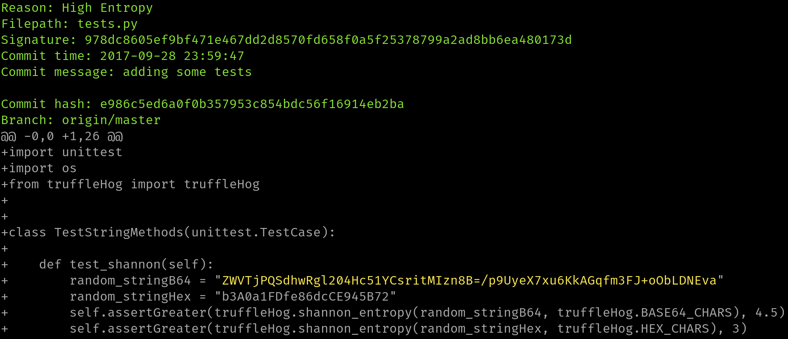

=======
tartufo
=======

`tartufo` searches through git repositories for secrets, digging deep into
commit history and branches. This is effective at finding secrets accidentally
committed. `tartufo` also can be used by git pre-commit scripts to screen
changes for secrets before they are committed to the repository.

This tool will go through the entire commit history of each branch, and check
each diff from each commit, and check for secrets. This is both by regex and by
entropy. For entropy checks, tartufo will evaluate the shannon entropy for both
the base64 char set and hexidecimal char set for every blob of text greater
than 20 characters comprised of those character sets in each diff. If at any
point a high entropy string > 20 characters is detected, it will print to the
screen.

Example
-------

Quick start
-----------

Getting started is easy!

#. Install tartufo from the `tartufo page on the Python Package Index`_, by
   using ``pip`` or using ``docker`` to pull the ``tartufo`` image from Docker Hub.

   Install using ``pip``:

   .. code-block:: console

      $ pip install tartufo

   Install using ``docker``:

   .. code-block:: console

      $ docker pull godaddy/tartufo

   For more detail, see :doc:`installation`.

#. Use ``tartufo`` to scan your repository and find any secrets in its history!

   .. code-block:: console

      # You can scan a remote git repo
      $ tartufo scan-remote-repo git@github.com:my_user/my_repo.git

      # Or, scan a local clone of a repo!
      $ tartufo scan-local-repo /path/to/your/git/repo

   .. code-block:: console

      # Scan a remote repo using docker
      $ docker run --rm godaddy/tartufo scan-remote-repo https://github.com/my_user/my_repo.git

      # Mount a local clone of a repo and scan it using docker!
      $ docker run --rm -v "/path/to/your/git/repo:/git" godaddy/tartufo scan-local-repo /git

   For more detail on usage and options, see :doc:`usage` and :doc:`features`.

Attributions
------------

This project was inspired by and built off of the work done by `Dylan Ayrey`_
on the `truffleHog`_ project.

.. toctree::
   :maxdepth: 1
   :caption: Table of Contents

   installation
   usage
   features
   configuration
   upgrading3
   CONTRIBUTING
   SECURITY
   changelog
   examplecleanup
   api

.. _tartufo page on the Python Package Index: https://pypi.python.org/pypi/tartufo
.. _Dylan Ayrey: https://github.com/dxa4481
.. _truffleHog: https://github.com/dxa4481/truffleHog
